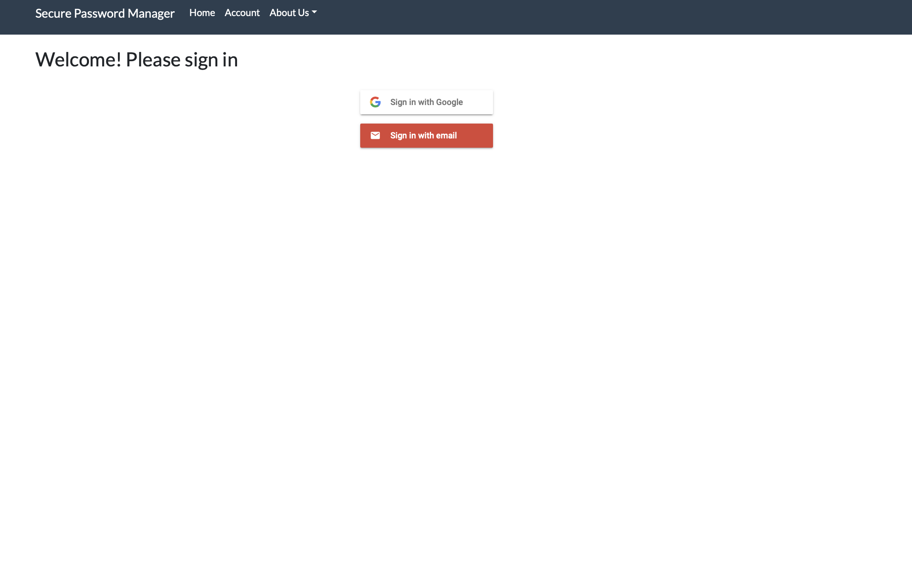
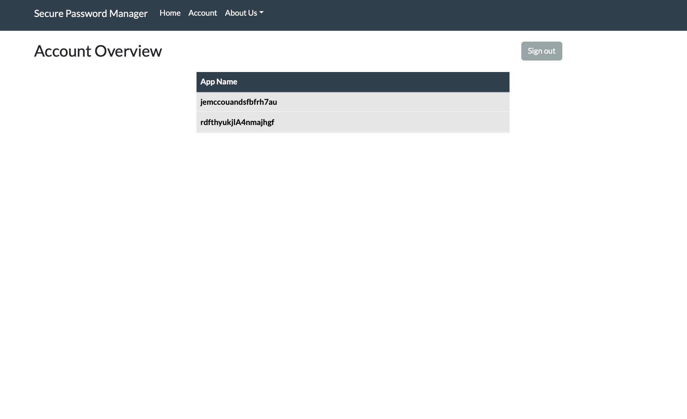
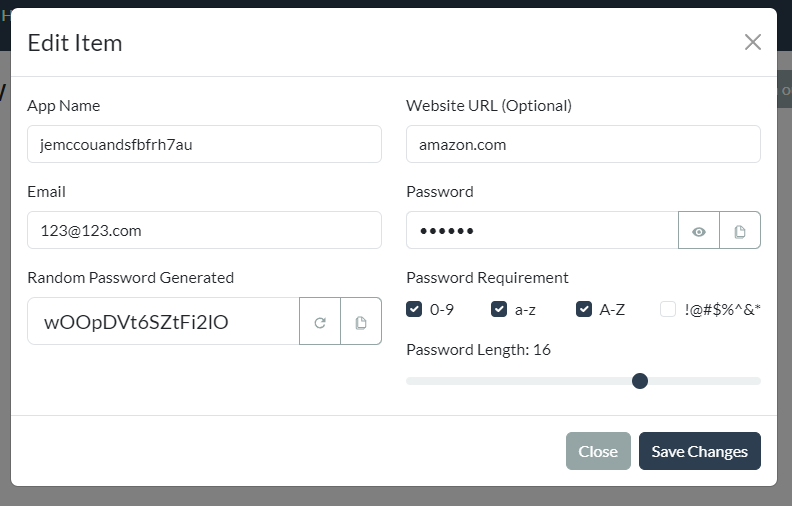

# 🔐 PASSWORD MANAGER 🔐

## User Guide
Hello and welcome to our password manager. This is a school project part of OSU where we were tasked with creating a fully functioning password manager hosted in the cloud. To learn more about the project requirements see [this](https://eecs.engineering.oregonstate.edu/capstone/submission/pages/viewSingleProject.php?id=FEs03aOtNYtTP8aO).

This section is a user guide showing you the three fundamental actions you can take in our application.

#### Signing in

You have two, equally secure options, for signing into our application. You can either sign in with an existing google account or you can sign in with a more traditional email/password.

#### Account overview

In the screenshot above you can see the account overview page which shows all of the saved passwords you have. Click on one to learn more!

#### View & Edit Item

When you click on a saved password you will be able to view/edit it. The UI above shows the following information:
* App name - name of the password
* Email - The email associated with the password
* Website URL (Optional) - The website associated with the password
* Password - The password itself

You also have the option to randomly generate a password if you would like a new one! We give you lots of customizability to create a secure password that works for you. Firstly, you can select what types of characters you would like included in the password. Secondly, you select the desired password length. After that you can click the circular arrow to regenerate passwords and the copy symbol to copy it to your keyboard!

## Link to other docs
We wrote lots of docs to explain different aspects of the applicaiton. You can find them in the `/docs` folder. Here are links to the different articles:
* [Api reference](/docs/api.md) - Full spec describing all of the API's this project uses.
* [DB reference](/docs/db.md) - Full spec describing the Cloud SQL database this project uses.
* [Repository details](/docs/github.md) - Describes how the github repo is setup.
* [GCP Details](/docs/gcp.md) - Notes on how GCP is utilized and how to work with it.
* [Frontend readme](/docs/frontend_readme.md) - README file for the frontend of the application.
* [Backend readme](/docs/backend_readme.md) - README file for the backend of the application.
* [Project structure](/docs/project_structure.md) - Details how the projects code is structured.
